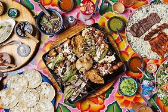
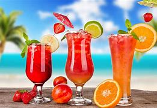

<html lang="en">
<head>
    <meta charset="UTF-8">
    <meta name="viewport" content="width=device-width, initial-scale=1.0">
    <title>Naniwa Foods</title>
    <link rel="stylesheet" href="https://stackpath.bootstrapcdn.com/bootstrap/4.5.2/css/bootstrap.min.css">
    <!-- Styling of website, this section of code adds aesthetics to the website -->
    
</head>
<body>
    <!-- Navigation -->
    <nav>
        <ul>
            <li><a href="#makeReservations">Make Reservations</a></li>
            <li><a href="#Address">Address</a></li>
            <li><a href="#Menu">Menu</a></li>
            <li><a href="#Drinks">Drinks</a></li>
            <li><a href="#Gallery">Gallery</a></li>
            <li><a href="#Contact">Contact</a></li>
        </ul>
    </nav>

    <!-- Dark theme toggle button -->
    <button id="themeButton">Naniwa foods</button>

    <!-- Welcome Section -->
    

        <h1>Welcome to Naniwa Foods</h1>
        
1020 Lavida St, Lala Land 
            Opening Hours: Everyday: 11 AM - 12 AM
        

        

            
        

    

    <!-- Carousel Section -->
    

        <ol class="carousel-indicators">
            <li data-target="#carouselExampleIndicators" data-slide-to="0" class="active"></li>
            <li data-target="#carouselExampleIndicators" data-slide-to="1"></li>
            <li data-target="#carouselExampleIndicators" data-slide-to="2"></li>
        </ol>
        

            

                
            

            

                
            

            

                
            

        

        <a class="carousel-control-prev" href="#carouselExampleIndicators" role="button" data-slide="prev">
            
            Previous
        </a>
        <a class="carousel-control-next" href="#carouselExampleIndicators" role="button" data-slide="next">
            
            Next
        </a>
    

    <!-- Menu Section -->
    

        <h2>Menu</h2>
        <h3>Lunch</h3>
        <h3>Dinner</h3>
        
Consuming Raw or Undercooked Meats, Poultry, Seafood, Shellfish, or Eggs May increase your risk of Foodborne Illness.

        

            
            
            
        

    

    <!-- Drinks Section -->
    

        <h2>Drinks</h2>
        <h3>Beer</h3>
        <h3>Wine</h3>
        <h3>Cocktails</h3>
        <h3>Spirits</h3>
        
There are a variety of drinks available in our restaurant.

        

            
            
        

    

    <!-- Gallery Section -->
    

        <h2>Gallery</h2>
        

            
            
            
            
        

    

    <!-- Contact Section -->
    

        <h2>Contact</h2>
        
For reservations, please call (123) 456-7890 or email us at reservations@naniwafoods.com.

        

            <a href="#"><i class="fab fa-facebook-f"></i></a>
            <a href="#"><i class="fab fa-twitter"></i></a>
            <a href="#"><i class="fab fa-instagram"></i></a>
            <a href="#"><i class="fab fa-linkedin-in"></i></a>
        

    

    
    
    
    
</body>
</html>
